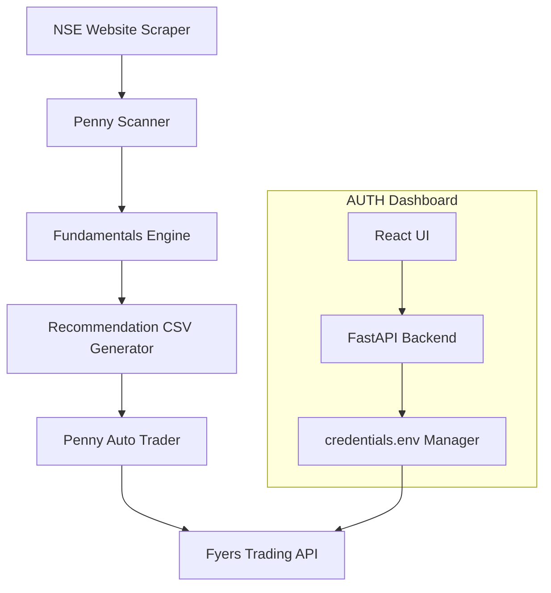
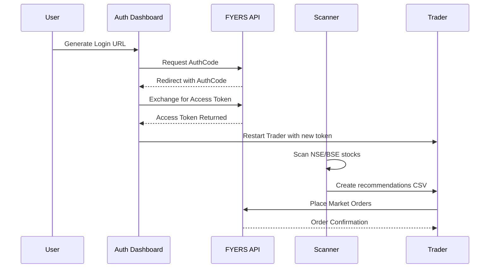

# FYERS Swing & Penny Trading Automation Suite

## Status Badges


---

# Overview

This repository provides a **fully automated trading system** built around FYERS API v3, including:

- Automated penny/swing stock scanning.
- Fundamental and technical filtering.
- Auto-trading engine with real FYERS execution.
- A **full authentication dashboard** (React + FastAPI) running inside Docker to simplify token management.
- A modular architecture following **SOLID principles**.
- Docker-first deployment.
- Multiple automated jobs and scanners.

All trading logic is written in Python and orchestrated via Docker Compose.

---

# Architecture Diagram (Mermaid)



---

# System Components

### 1. Penny Scanner  
Fetches stocks from NSE/BSE and applies custom logic to identify potential trades.

### 2. Fundamentals Engine  
Scores stocks based on profitability, growth, PE, and other filters.

### 3. Recommendation Generator  
Produces structured CSV for all scanners.

### 4. Auto-Trader  
Places market orders via FYERS, following:
- validated ranges  
- deduplicated daily execution  
- stop-loss and targets

### 5. Authentication Dashboard (Dockerized)
A React + FastAPI UI to:
- Generate auth URL
- Exchange auth code
- Save token
- Restart trading containers automatically
- Test profile authentication
- Trigger scanners and trading modules

---

# Repository Structure

```
fyers-swing-docker/
│
├── auth-dashboard/
│   ├── backend/ (FastAPI)
│   └── frontend/ (React + Vite)
│
├── core/
│   ├── auth.py
│   ├── data_feed.py
│   ├── order_manager.py
│   ├── risk_manager.py
│   └── universe.py
│
├── scripts/
│   ├── penny_scanner.py
│   ├── fundamentals.py
│   ├── market_data.py
│   ├── penny_auto_trader.py
│   ├── penny_reco_scheduler.py
│   ├── technical_analysis.py
│   └── debug_history.py
│
├── data/
│   ├── penny_recommendations.csv
│   ├── penny_fundamentals.csv
│   ├── penny_trades_executed.csv
│   └── scan_profitability_yf.csv
│
├── docker-compose.yml
├── Dockerfile
└── README.md
```

---

# Trading Flow Diagram



---

# Backend API Documentation (FastAPI)

### `GET /api/auth-url`
Returns FYERS login URL.

### `POST /api/exchange`
Body:
```json
{
  "auth_code": "..."
}
```
Returns:
- access_token  
- refresh_token  
- raw API response  

### `POST /api/save-token`
Body:
```json
{
  "access_token": "xxx",
  "restart_docker": true
}
```

### `GET /api/test-profile`
Tests the validity of the stored access token.

### `POST /api/run-scanner`
Runs penny scanner and returns updated recommendations.

### `POST /api/run-fundamentals`
Runs fundamentals engine.

### `POST /api/run-auto-trader`
Executes trades from recommendations.

### `POST /api/clear-executed-errors`
Cleans erroneous rows from `penny_trades_executed.csv`.

---

# Swagger UI

You can view automatic API documentation at:

```
http://localhost:8000/docs
```

---

# Docker Deployment

### Build & start entire system:

```bash
docker compose up -d --build
```

### Reset & Rebuild from scratch:

```bash
./docker_reset_and_rebuild.sh
```

---

# Technology Stack

| Layer | Technology |
|------|-------------|
| Frontend | React + Vite |
| Backend | FastAPI |
| Trading Engine | Python + FYERS API v3 |
| Data Processing | Pandas, NumPy |
| Scheduler | Cron + Python jobs |
| Deployment | Docker, Docker Compose |

---

# Full Wiki Pages (Index)

Create a `/wiki` folder including:

- **Architecture Overview**
- **Jobs & Automation**
- **Trading Strategy**
- **Risk Management**
- **Token Lifecycle**
- **CSV Formats & Data Flow**
- **Troubleshooting**
- **Extending the Engine**

---

# License
MIT License.

---

# Author
Avinash Kumar

---

# Notes
This README is auto-generated per project specs and includes diagrams, API docs, and docker deployment flow.
